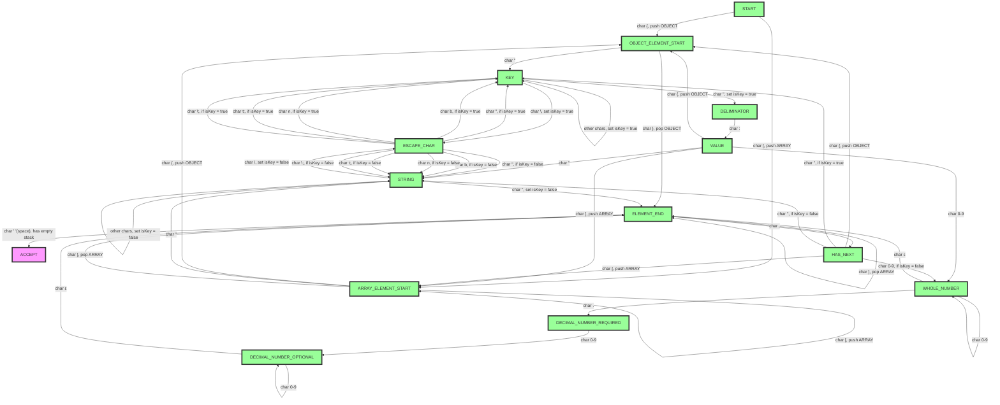
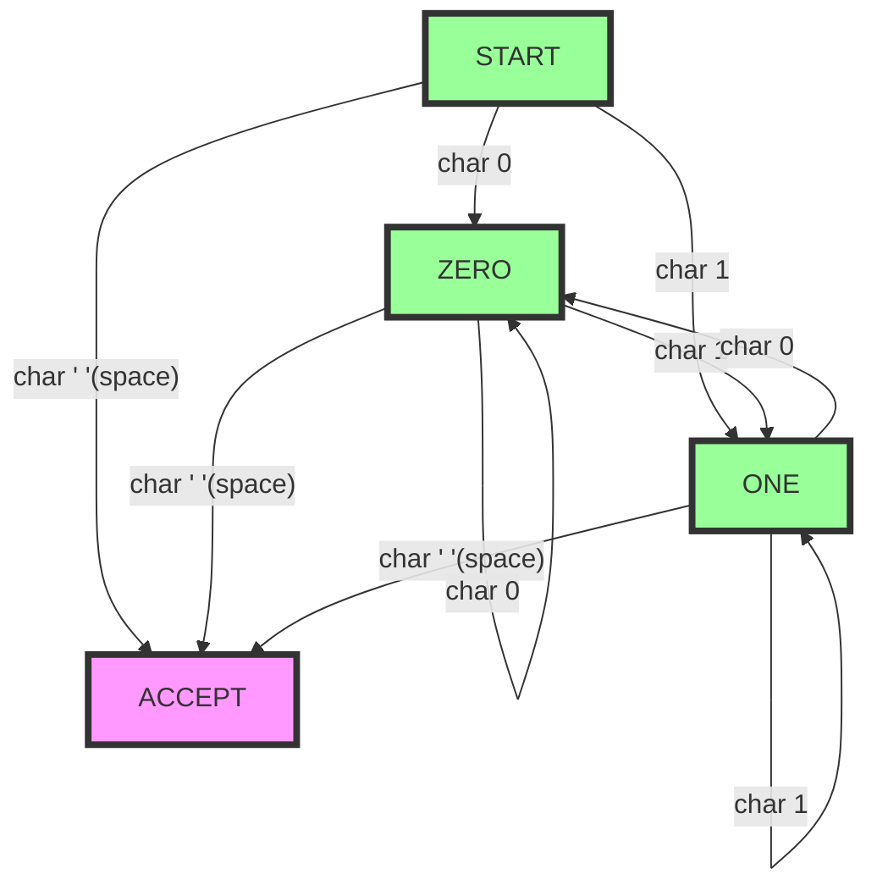

<h1>File Syntax Validator</h1>

    This project comes with some predefined file syntax validators:

<ul>
    <li>Json</li>
    <li>Binary</li>
</ul>

    You can add you own file types by simply doing the following steps:

<ol>
    <li>Define an enum of states implementing the State interface.</li>
    <li>Define a class of state transitions implementing the TuringMachine interface.</li>
    <li>Create a validator with the TuringMachine class and the start state and register to via FileTypeRegistry.addFileType.</li>
    <li>Call FileValidation.runValidation to use.</li>
</ol>

<h2>
    ε-non-deterministic Turing Machine of default Json validation
</h2>

    The below diagram indicates the flow of validation 
    of json files character by character:

<h2>
    ε-non-deterministic Turing Machine of default Binary Validation
</h2>

    The below diagram indicates the flow of validation 
    of binary files character by character:

    Note:

<ul>
    <li>
        any unspecified character movements are to an implicit reject state, 
        which theoretically loops to stay there (In reality short circuits 
        the machine to avoid pointless computations)
    </li>
    <li>
        an explicit accept transition is required, working on a transition of the
        space character at the end of the file contents. This space is added by the
        validator, but you will be required to cover the state transition.
    </li>
</ul>